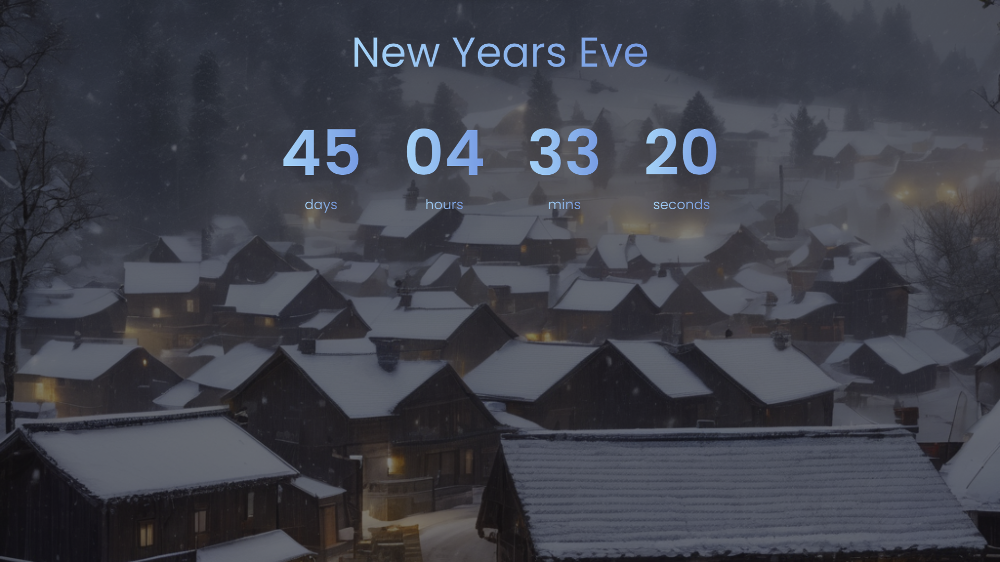

# Countdown Timer

A simple and stylish New Year's Eve countdown timer website built with HTML, CSS, and JavaScript.

## Features

- Countdown to New Year's Eve
- Responsive design for various devices
- Gradient text and background for an attractive look

## Demo

Check out the live demo: [Countdown Timer](https://countdown-timer-kvitsi.netlify.app/)

## Usage

Clone the repository:

git clone https://github.com/kvitsi/countdown-timer.git
cd countdown-timer

Open `index.html` in your web browser.

## License

This project is licensed under the [MIT License](LICENSE).

## Acknowledgments

- Background image: [Unsplash](https://unsplash.com)

## Contact

Feel free to reach out with any questions or feedback:

- Email: kvitsianinika@gmail.com
- Twitter: [Kvitsianinika](https://twitter.com/Kvitsianinika)
- LinkedIn: [Nika Kvitsiani](https://www.linkedin.com/in/nika-kvitsiani/)
